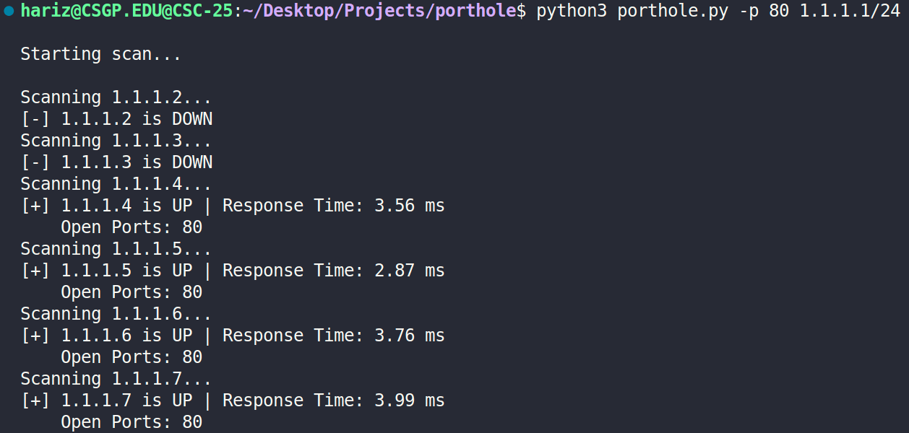

# Porthole

Porthole is a Python script that scans a CIDR network range based on user input. It pings each host to see which IP addresses are online and then scans specified ports on any host that is up. It displays whether each IP address is up or down, its response time, and any open ports found.

## Requirements

- Python 3 or higher
- Git

## Installation

1. Clone the Repository
```bash
git clone https://github.com/ZoltanHari/porthole.git
```
2. Open the Cloned Repository
```bash
cd porthole
```

## Usage

1. Start the program with: **`python3 porthole.py -p <ports> <CIDR>`**

2. Wait for the program to ping all of the IP addresses in the network range and scan all open ports

## Port Formats

1. Single port
```python
python3 porthole.py -p 80 192.168.1.0/24
```

2. Port range
```python
python3 porthole.py -p 1-100 192.168.1.0/24
```
3. Multiple ports
```python
python3 porthole.py -p 80,443,3306 192.168.1.0/24
```
## Usage Example


